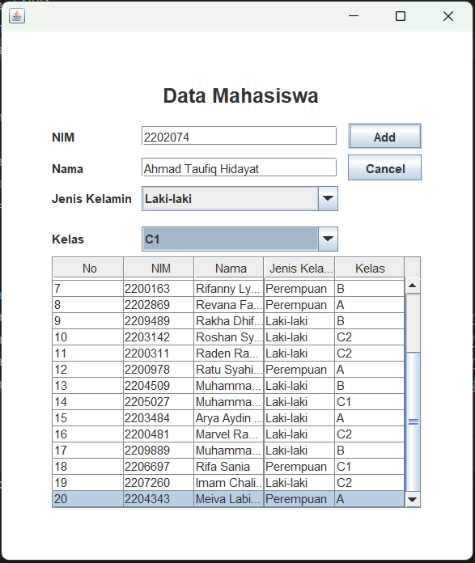
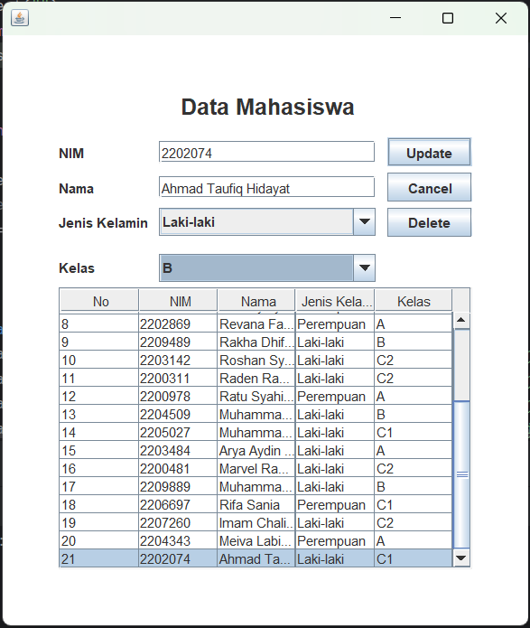
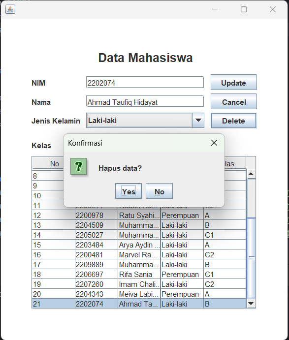
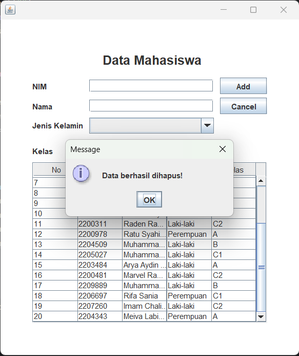

# Latihan Praktikum 5 DPBO

## Janji

Saya Ahmad Taufiq Hidayat dengan NIM 2202074 mengerjakan LP5
dalam mata kuliah DPBO untuk keberkahanNya maka saya tidak
melakukan kecurangan seperti yang telah dispesifikasikan. Aamiin.

## Data Diri

- 2202074
- Ahmad Taufiq Hidayat
- Ilmu Komputer C1'22
- Universitas Pendidikan Indonesia

## Detail Implementasi

Pada program ini merupakan implementasi Object Oriented Programming dengan menggunakan Java GUI Kit, program yang dibuat berisi form input data mahasiswa dengan atribut NIM, Nama, Jenis Kelamin, dan Kelas. program ini juga dapat menampilkan, mengubah, dan menghapus data yang telah disimpan.

## Menambahkan atribut

Program yang saya buat menambahkan atribut `kelas` menggunakan tipe `JComboBox`, dan menambahkan menu konfirmasi sebelum menghapus sebuah data.

## Screenshot

